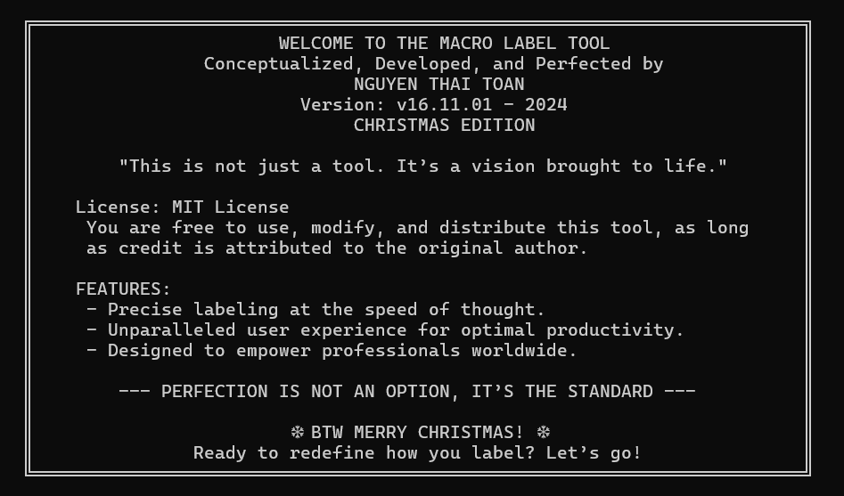

# MACRO v16.11.01 TUTORIAL - v08.12.05 FINAL

    Author: Nguyen Thai Toan
    License: MIT
    Date of Publication: 08.12.2024

# Introduction

This tool is designed to enhance labeling tasks in general, and streamline the workflow on the labelme platform in particular, making the process faster and more efficient. It leverages Python libraries such as keyboard and pyautogui for actions like pointing, renaming labels, drawing boxes, deleting, and handling key movements.

Special thanks to Duong, Tu, and friends for their support and contributions in developing and refining this tool. (Even though, admittedly, I relied on it so much that I lost track of my KPIs!)

# HOW TO USE

### Step 1
- You can clone this repository or download the .exe file directly for convenience.
- In the repository, you will find keymap.png, which shows the key mappings and their functions.
- You will also find Key_mapping.txt, where all the functions are listed. If you have any questions about how it works, feel free to message me anytime!

### Step 2
- Try using it, enjoy it, and if there are some bugs, just fix yourself. Im so tired of improve the version of this wonderful tool!

# GOOD LUCK HOMMIES & MERRY CHRISTMAS
